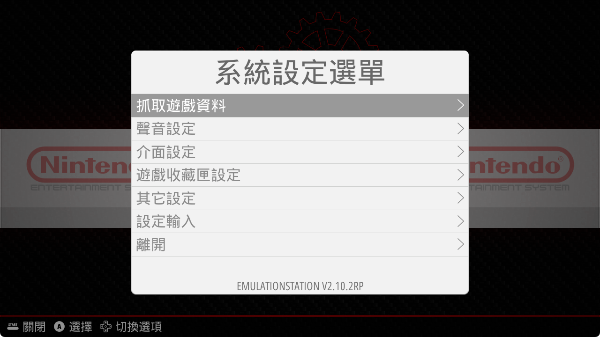
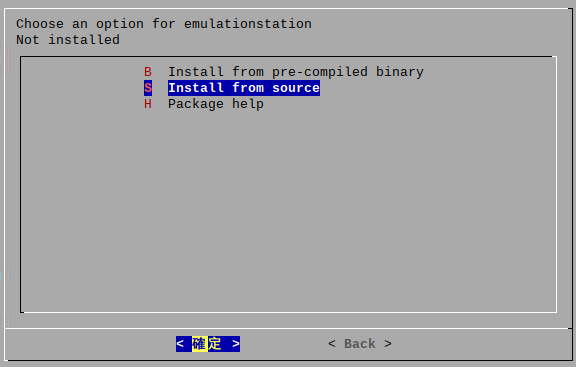

# Localized EmulationStation

This is a localized fork of [Retropie's EmulationStation fork](https://github.com/RetroPie/EmulationStation).

The original source was reference from [flyinghead/EmulationStation](https://github.com/flyinghead/EmulationStation), but it seem to stop maintain from Jun 2019 and did not support RPi4.

So I've redo from the lastest source [(branch: stable)](https://github.com/RetroPie/EmulationStation/commit/2dd5e6b67932e300e56bc8a18091d7a09bc5122b) and tested on Ubuntu 20.04 LTS & Raspberri 4B (OS: Buster 32 bit recommend).


## Languages currently supported

* Catalan
* French
* German
* Italian
* Japanese
* Korean
* Portuguese (Brazilian)
* Spanish (Spain)
* Traditional Chinese (Taiwan)

## Step start
Install the needed packages for the Official `RetroPie setup script`:

### For Linux (Debian/Ubuntu/Raspberry)

```bash
sudo apt update && sudo apt upgrade
```

***On Debian/Ubuntu:***

```bash
sudo apt update && sudo apt upgrade
sudo apt install -y git dialog unzip xmlstarlet
```

***On Raspberry:***

```bash
sudo apt update && sudo apt upgrade
sudo apt install git lsb-release
```

### Download `RetroPie setup script` and install

```bash
cd ~
git clone --depth=1 https://github.com/RetroPie/RetroPie-Setup.git
cd RetroPie-Setup
chmod +x retropie_setup.sh
sudo ./retropie_setup.sh
```
Choose **Full Install** `(Basic Install >> Quick Install)` or **Partial Install** `(Manage packages >> Manage core packages)` to install EmulationStation. **Partial Install** could install minimal packages for saving lots of time.

**For Raspberry users :** If you choose `(Basic Install >> Quick Install)` that it were install from pre-compiled binary default. You have to remove and reinstall EmulationStation again by choose `Install from source`. 



## How to use this localized EmulationStation

### Resolve dependencies of libraries

```bash
sudo apt-get install -y libboost-system-dev libboost-filesystem-dev libboost-date-time-dev libboost-locale-dev libfreeimage-dev libfreetype6-dev libeigen3-dev libcurl4-openssl-dev libasound2-dev cmake libsdl2-dev gettext
```

### Create a clone from GitHub

```bash
cd ~
git clone --recursive https://github.com/benjenq/EmulationStation.git
```

### Compile EmulationStation

**For Linux (Debian/Ubuntu/Raspberry)**

```bash
cd ~/EmulationStation
mkdir build
```

***On Debian/Ubuntu:***

```bash
cd ~/EmulationStation/build
cmake ..
make
```

***On Raspberry(4B tested):***
```bash
cd ~/EmulationStation/build
cmake -DFREETYPE_INCLUDE_DIRS=/usr/include/freetype2/ -DRPI=On -DUSE_MESA_GLES=On ..
make
```
### Run EmulationStation

> Be aware that your system must be set to the same locale that you want EmulationStation to run on.

```bash
cd ~/EmulationStation
LANG=[your_locale].UTF8 ./emulationstation
```

### Install EmulationStation

It will replace your original EmulationStation which installed via `RetroPie setup script`.

```bash
cd ~/EmulationStation
sudo cp ./emulationstation /opt/retropie/supplementary/emulationstation/
sudo cp -r locale /opt/retropie/supplementary/emulationstation/
```

## How to add a translation

> You should have, at least, [created a clone from GitHub](#create-a-clone-from-github) before continuing with the following steps.

### Create files for the new locale

```bash
cd ~/EmulationStation/locale
mkdir lang/[your_locale]
cp emulationstation2.pot lang/[your_locale]/emulationstation2.po
```

### Translate the strings

Open the newly created `emulationstation2.po` inside `[your_locale]` folder and start translating all the `msgstr` strings.

Once you are done, you can [compile EmulationStation](#compile-emulationstation) and then [run](#run-emulationstation) it to test your translations.

### Supplemental Instruction

If you found the user interface was displayed abnormal (eg. lost language, empty item... ) after compile & install, please check if these fonts exist on your system

```
/usr/share/fonts/truetype/dejavu/DejaVuSans.ttf
/usr/share/fonts/truetype/freefont/FreeMono.ttf
/usr/share/fonts/truetype/droid/DroidSansFallbackFull.ttf
```

## Author

**original :** [flyinghead](https://github.com/flyinghead)

**rework :** [benjenq](https://github.com/benjenq)


## Credits

Thanks to:

* [flyinghead](https://github.com/flyinghead) - For source code reference & the French translations.
* [heloisa](https://github.com/heloisatech) - For the Portuguese (Brazilian) and Spanish (Spain) translations.
* [wakaya](https://retropie.org.uk/forum/user/wakaya) - For the Japanese translations and for the instructions on how to use the localized EmulationStation.
* [hiulit](https://github.com/hiulit) - For the Catalan and Spanish (Spain) translations.
* [Taranchul](https://github.com/Taranchul) - For the German translations.
* Unknown - For the Italian translations.
* [losernator](https://github.com/losernator) - For the Korean translations.
